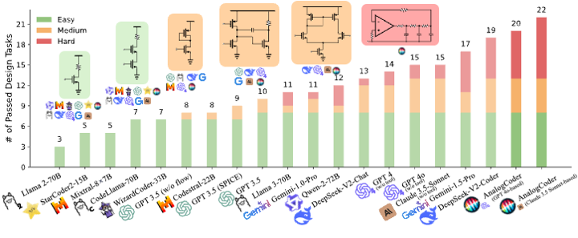

# AnalogCoder: Analog Circuit Design via Training-Free Code Generation

**New:** Our paper is accepted by **AAAI 2025** as an **Oral Presentation (Top 5%)**, and selected as **AAAI 2025 Most Influential Papers**.

<p align="center">
  
</p>

This repository contains the official implementation of the AAAI 2025 paper:

**AnalogCoder: Analog Circuit Design via Training-Free Code Generation**

**Authors:**  
[Yao Lai](https://laiyao1.github.io/)<sup>1</sup>,
[Sungyoung Lee](https://brianlsy98.github.io/)<sup>2</sup>,
[Guojin Chen](https://gjchen.me/)<sup>3</sup>,
[Souradip Poddar](https://www.linkedin.com/in/souradip-poddar-52376212a/)<sup>2</sup>,
[Mengkang Hu](https://aaron617.github.io/)<sup>1</sup>,
[David Z. Pan](https://users.ece.utexas.edu/~dpan/)<sup>2</sup>,
[Ping Luo](http://luoping.me/)<sup>1</sup>

<sup>1</sup> The University of Hong Kong  
<sup>2</sup> The University of Texas at Austin  
<sup>3</sup> The Chinese University of Hong Kong  

<p align="center">
  <a href="https://mmlab.hk/" target="_blank">
    
  </a>
  &nbsp;&nbsp;&nbsp;
  <a href="https://www.cerc.utexas.edu/utda/" target="_blank">
    
  </a>
</p>


## 🏆 Highlights

- **AAAI 2025 Oral Presentation** (Top 5%)
- **AAAI 2025 Top-15 Influential Papers** [[Rank 11](https://resources.paperdigest.org/2025/09/most-influential-aaai-papers-2025-09-version/)]

**Links:** [[Paper](https://arxiv.org/pdf/2405.14918)]

> **NEW RELEASE**  
> An extended version, **AnalogCoder-Pro**, is available:  
> [[Paper](https://arxiv.org/abs/2508.02518)] [[Repo](https://github.com/laiyao1/AnalogCoderPro)]


## Introduction

<p align="center">
  
</p>

**Analog circuit design** is a critical component of modern chip development. It involves selecting device types, defining connectivity, and tuning parameters to meet functional and performance requirements. While LLMs have shown strong capabilities in **digital** design tasks, analog design remains challenging due to the **complexity** of circuits and the **scarcity of high-quality data**.

To address these challenges, we introduce **AnalogCoder**, the *first* **training-free** LLM agent for analog circuit design that formulates design as **Python code generation**.

### Key advantages

- **Feedback-enhanced agentic workflow** with domain-specific prompts for robust autonomous design.
- A **circuit skill library** that archives successful designs as reusable modular subcircuits, enabling easier composition of complex systems.
- Extensive evaluation on a curated benchmark of **24** analog circuit design tasks shows that AnalogCoder successfully designed **20** circuits, outperforming existing baselines.

In summary, AnalogCoder helps reduce the labor intensity of analog chip design and enables non-experts to design analog circuits more efficiently.


## Evaluation of LLMs

**Ranking rule:** higher **#Solved** (successfully solved circuit design tasks) ranks first. If tied, higher **Avg. Pass@1** ranks first.

| LLM Model                          | Avg. Pass@1 | Avg. Pass@5 | #Solved |
|------------------------------------|------------:|------------:|--------:|
| Llama2-7B                          |         0.0 |         0.0 |       0 |
| Llama2-13B                         |         0.0 |         0.0 |       0 |
| SemiKong-8B*                       |         0.1 |         0.7 |       1 |
| Llama3-8B                          |         0.1 |         0.7 |       1 |
| Phi3-14B                           |         0.3 |         1.3 |       1 |
| Qwen-1.5-110B                      |         0.3 |         1.4 |       2 |
| CodeLlama-13B                      |         0.6 |         2.5 |       2 |
| Mistral-7B                         |         3.3 |         7.7 |       2 |
| Llama 2-70B                        |         5.1 |         9.8 |       3 |
| CodeQwen-1.5-7B                    |         1.1 |         5.6 |       4 |
| CodeLlama-34B                      |         1.9 |         7.4 |       4 |
| CodeLlama-7B                       |         2.4 |         9.0 |       4 |
| DeepSeek-Coder-33B                 |         4.0 |        10.2 |       4 |
| Llama3.1-8B                        |         4.9 |        12.9 |       4 |
| Magicoder-7B                       |         3.8 |         8.6 |       5 |
| Mixtral-8×7B                       |         5.6 |        12.4 |       5 |
| StarCoder2-15B-Instruct            |         5.6 |        12.4 |       5 |
| CodeGeeX4-9B*                      |        10.6 |        20.3 |       6 |
| CodeLlama-70B                      |         3.2 |        12.2 |       7 |
| CodeGemma-7B                       |         6.9 |        17.0 |       7 |
| WizardCoder-33B                    |         7.1 |        16.9 |       7 |
| GPT-3.5 (w/o context)              |         8.1 |        18.5 |       7 |
| GPT-3.5 (w/o flow)                 |        12.8 |        25.3 |       8 |
| Codestral-22B                      |        16.4 |        29.1 |       8 |
| GPT-3.5 (w/o CoT)                  |        19.4 |        26.3 |       8 |
| GLM-4                              |        22.8 |        31.2 |       8 |
| GPT-3.5 (SPICE)                    |        13.9 |        26.9 |       9 |
| GPT-3.5                            |        21.4 |        35.0 |      10 |
| GPT-3.5 (fine-tune)                |        28.1 |        39.6 |      10 |
| Llama3-70B                         |        28.8 |        36.4 |      11 |
| Gemini-1.0-Pro                     |        28.9 |        41.2 |      11 |
| Gemini-1.5-Flash                   |        35.7 |        40.6 |      11 |
| Qwen-2-72B                         |         9.3 |        26.6 |      12 |
| GPT-4o-mini                        |        34.9 |        41.7 |      12 |
| DeepSeek-V2-Chat                   |        38.6 |        44.3 |      13 |
| GPT-4 (w/o tool)                   |        51.1 |        57.7 |      14 |
| Llama3.1-70B                       |        25.4 |        42.6 |      14 |
| GPT-4o (w/o tool)                  |        54.2 |        58.9 |      15 |
| Claude-3.5-Sonnet (w/o tool)       |        58.1 |        60.7 |      15 |
| Mistral-Large-2                    |        28.6 |        51.0 |      17 |
| Gemini-1.5-Pro                     |        33.9 |        44.6 |      17 |
| DeepSeek-V2-Coder                  |        56.5 |        69.2 |      19 |
| Llama3.1-405B                      |        56.9 |        70.7 |      20 |
| **AnalogCoder (GPT-4o-based)**     |        66.1 |        75.9 |      20 |
| **AnalogCoder (Claude-3.5-based)** |        76.1 |        86.3 |      22 |

\* Without CoT (prompting the model to directly generate code rather than explicit device-level reasoning) due to token limitations or model specialization.

**Notes**
1. All results are reproducible.
2. The core Python environment setup does **not** require sudo privileges.  
   (However, installing system dependencies such as `ngspice` or `ollama` may require admin permissions depending on your OS.)


## Installation

AnalogCoder requires:
- **Python** ≥ 3.10  
- **PySpice** ≥ 1.5  
- **openai** ≥ 1.16.1  
- **ngspice** (as the SPICE backend)

### Option A: Install via `environment.yml` (recommended)

```bash
git clone https://github.com/laiyao1/AnalogCoder.git
cd AnalogCoder
conda env create -f environment.yml
conda activate analog
```

### Option B: Manual installation

```bash
git clone https://github.com/laiyao1/AnalogCoder.git
cd AnalogCoder

conda create -n analog python=3.11 -y
conda activate analog

pip install matplotlib pandas numpy scipy ollama openai

# SPICE backend (recommended via conda-forge)
conda install -c conda-forge ngspice -y

# PySpice
git clone https://github.com/PySpice-org/PySpice.git
cd PySpice
pip install -e .
cd ..
```


## (Optional) Ollama Setup (for local open-source LLMs)

> This section is only needed if you want to run open-source LLMs locally.

1) Install Ollama (Linux)

```bash
sudo apt-get update
sudo apt-get install -y zstd
curl -fsSL https://ollama.com/install.sh | sh
```

2) Start the Ollama server

```bash
nohup ollama serve > ollama.log 2>&1 &
```

3) Pull a model (example: `qwen3-coder`)

```bash
ollama pull qwen3-coder
```


## Environment Check

To verify your environment:

```bash
cd sample_design
python test_all_sample_design.py
```

If the output contains `All tasks passed`, your environment is ready.

If it prints `Please check your environment and try again`, please re-check your Python environment—especially `PySpice` and `ngspice` related setup.


## Quick Start

### Run with OpenAI models

```bash
python gpt_run.py --task_id=1 --api_key="[OPENAI_API_KEY]" --num_per_task=1
```

This generates **one** circuit solution for task 1.

### Run with a local open-source model (Ollama)

Make sure `ollama serve` is running first, then:

```bash
python gpt_run.py --model qwen3-coder --task_id=1
```


## Benchmark

- Task descriptions: `problem_set.tsv`
- Sample circuits: `sample_design/`
- Testbenches / checking scripts: `problem_check/`


## Citation

If you find this work useful, please cite:

```bibtex
@misc{lai2024analogcoder,
  title={AnalogCoder: Analog Circuit Design via Training-Free Code Generation},
  author={Yao Lai and Sungyoung Lee and Guojin Chen and Souradip Poddar and Mengkang Hu and David Z. Pan and Ping Luo},
  year={2024},
  eprint={2405.14918},
  archivePrefix={arXiv},
  primaryClass={cs.LG}
}
```


## Star History

[![Star History Chart][image_0]](https://www.star-history.com/#laiyao1/AnalogCoder&type=date&legend=top-left)
```
